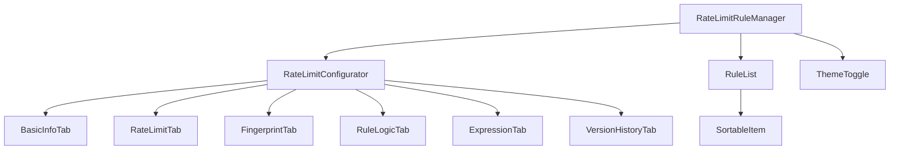
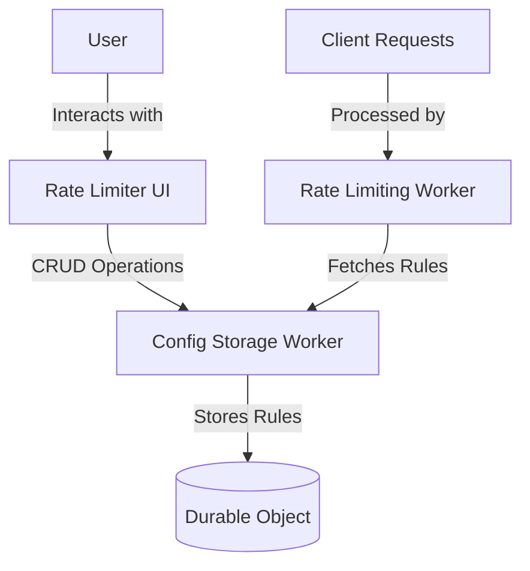
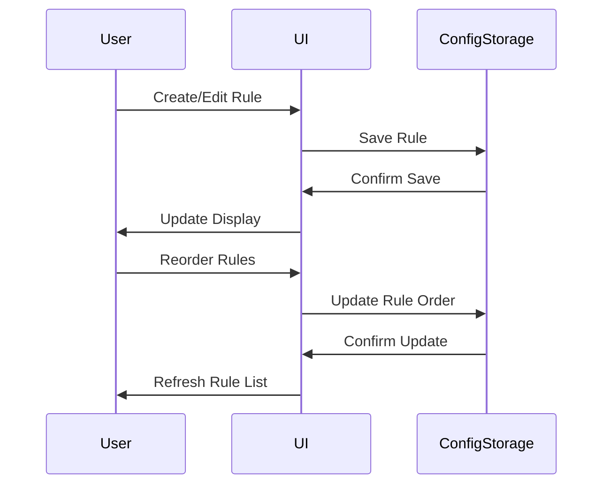

# Rate Limiter UI

## Table of Contents
1. [Overview](#overview)
2. [Project Structure](#project-structure)
3. [Key Components](#key-components)
4. [System Architecture](#system-architecture)
5. [Workflow](#workflow)
6. [State Management](#state-management)
7. [API Endpoints](#api-endpoints)
8. [Durable Object Integration](#durable-object-integration)
9. [Development](#development)
10. [Deployment](#deployment)
11. [Technologies Used](#technologies-used)
12. [Security Considerations](#security-considerations)
13. [Related Components](#related-components)

## Overview

The Rate Limiter UI is a web application built using the Astro Web Framework. It provides a user-friendly interface for managing rate limiting rules that are applied by the Rate Limiting Worker. The UI allows users to create, edit, delete, and reorder rate limiting rules, which are stored in a Durable Object bound to the Config Storage Worker.

## Project Structure

```
rate-limiter-ui/
├── src/
│   ├── components/
│   │   ├── ActionFields.tsx
│   │   ├── add-rule-button.tsx
│   │   ├── BasicInfoTab.tsx
│   │   ├── ConditionRenderer.tsx
│   │   ├── ExpressionTab.tsx
│   │   ├── FingerprintTab.tsx
│   │   ├── RateLimitConfigurator.tsx
│   │   ├── RateLimitRuleManager.tsx
│   │   ├── RateLimitTab.tsx
│   │   ├── rule-configurator-dialog.tsx
│   │   ├── rule-list.tsx
│   │   ├── RuleLogicTab.tsx
│   │   ├── sortable-item.tsx
│   │   ├── theme-toggle.tsx
│   │   ├── time-display.tsx
│   │   ├── version-history-dialog.tsx
│   │   └── VersionHistoryTab.tsx
│   ├── layouts/
│   │   └── Layout.astro
│   ├── pages/
│   │   └── index.astro
│   ├── store/
│   │   └── ruleStore.ts
│   ├── styles/
│   │   └── global.css
│   └── types/
│       └── ruleTypes.ts
├── public/
├── astro.config.mjs
├── package.json
├── tailwind.config.mjs
├── tsconfig.json
└── wrangler.toml
```

## Key Components



1. **RateLimitRuleManager**: The main component that manages the list of rules and handles CRUD operations.
2. **RateLimitConfigurator**: Handles the configuration of individual rules, including basic info, rate limit settings, fingerprint configuration, and rule logic.
3. **RuleList**: Displays the list of rules and allows for reordering.
4. **ThemeToggle**: Allows switching between light and dark themes.

## System Architecture



## Workflow



## State Management

The application uses Zustand for state management. The `ruleStore.ts` file contains the store definition with actions for fetching, adding, updating, deleting, and reordering rules.

## API Endpoints

The UI interacts with the following API endpoints provided by the Config Storage Worker:

- `GET /api/config`: Fetch all rules
- `POST /api/config`: Add a new rule
- `PUT /api/config/rules/:id`: Update an existing rule
- `DELETE /api/config/rules/:id`: Delete a rule
- `PUT /api/config/reorder`: Reorder rules
- `PUT /api/config/rules/:id/revert`: Revert a rule to a previous version
- `GET /api/config/rules/:id/versions`: Get version history for a rule

## Durable Object Integration

The UI worker has a binding to a Durable Object named `CONFIG_STORAGE`. This object is responsible for storing and managing the rate limiting rules. The Durable Object provides persistence and consistency for the rule configurations.

## Development

To run the project locally:

1. Clone the repository:
   ```
   git clone https://github.com/erfianugrah/rate-limiter-ui.git
   cd rate-limiter-ui
   ```

2. Install dependencies:
   ```
   npm install
   ```

3. Start the development server:
   ```
   npm run dev
   ```

4. Open your browser and navigate to `http://localhost:3000`

## Deployment

The project is configured to be deployed as a Cloudflare Pages project.

1. Build the project:
   ```
   npm run build
   ```

2. Deploy to Cloudflare Pages:
   ```
   npm run deploy
   ```

Ensure that the `wrangler.toml` file contains the necessary configuration for the Durable Object binding and other deployment settings.

## Technologies Used

- Astro
- React
- Tailwind CSS
- Zustand
- dnd-kit (for drag-and-drop functionality)
- Cloudflare Workers and Durable Objects

## Security Considerations

- Implement proper authentication and authorization mechanisms to protect the rate limit configuration API endpoints.
- Use environment variables for sensitive information and API keys.
- Implement CSRF protection for form submissions.
- Regularly update dependencies to patch any security vulnerabilities.

## Related Components

This UI is part of a larger rate limiting system. The other components are:

1. [Rate Limiter Config Storage](https://github.com/erfianugrah/rate-limiter-config-storage): Stores and manages the rate limiting rules.
2. [Rate Limiting Worker](https://github.com/erfianugrah/rate-limiter-worker): Applies the rate limiting rules to incoming requests.

For a complete setup, ensure all components are properly configured and deployed.
